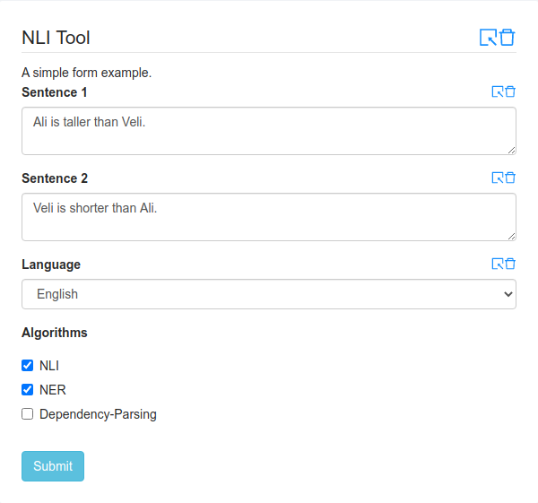

.. _form-schema-tutorial:

Form Schema Tutorial
====================

In this section we describe how you can easily generate a form schema. We first use a graphical form builder (https://knilink.github.io/react-jsonschema-formbuilder) and then implement a simple Flask endpoint for that in python.

Say that you have implemented a Natural Language Inference tool, of course while implementing it, you consider the fact that you will implement an HTTP endpoint for that tool and reduced your I/O and memory overhead as much as you can by doing all of these operations at the startup of the program.

For the sake of example:

* Your program can run in 3 different languages: Turkish, German, and English
* Your Program can also do NER and Dependency-Parsing

I have not mentioned how to generate such form, since the tool is pretty usable.

Now we have 3 json objects: schema, ui-schema and formData. If you save using the website's save button
it will download a file called "root.json". This file contains schema and ui-schema information. We also need formData.

formData is used to store default values; if you fill in the form fields formData is automatically generated. You should fill them in, it is better to have deafults and it is helpful for writing a bug-free endpoint as you can see below. After you fill in the form fields with default values; copy the contents of "Form Data" in the website to a file named "form_data.json".

In our example we have the following formData

.. code-block:: json
    :linenos:

    {
      "checkboxes": [
        "NLI",
        "NER"
      ],
      "textarea": "Ali is taller than Veli.",
      "textarea_1": "Veli is shorter than Ali.",
      "dropdown": "Turkish"
    }

For that we want to implement an endpoint that parses the above json string and passes it to the NLI functions, and finally, return back the answer in the output's specified format. (Check  :ref:`output specification tutorial <output-tutorial>` for this.)

.. code-block:: python
    :linenos:

    import nli
    # this is supposed to import the nli library, 
    #    by importing it it sets up all the models, 
    #    makes all file operations 
    #    so it will not do these costly operations for each request.

    from flask import Flask, json, g, request, jsonify, json
    # import flask

    app = Flask(__name__)

    @app.route("/evaluate", methods=["POST"])
    def evaluate():
        json_data = json.loads(request.data)["query"]
        # query is used as a wrapper by the front-end by default
        # read the json fields
        # for your form fields:
        #    you need to consider possible empty / illegal values as well
        algorithms = json_data["checkboxes"]
        premise = json_data["textarea"]
        hypothesis = json_data["textarea_1"]
        language = json_data["dropdown"]

        result = nli.run_algorithm(algorithms, premise, 
                                    hypothesis, language)
        response = app.response_class(
            response=json.dumps(result),
            status=200,
            mimetype='application/json'
        )
        return response

    if __name__ == "__main__":
       app.run(host='0.0.0.0')

So now; you have a running HTTP endpoint, a form_data.json file and root.json file. :ref:`Project Structure Tutorial <project-structure-tutorial>` to put everything together.
